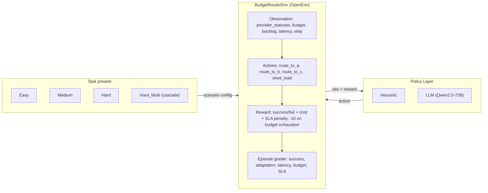

# Budget Router (OpenEnv)

Budget Router is an OpenEnv-compliant RL environment where an agent routes requests to one of three providers (A/B/C) or sheds load under a tight **cost–reliability–SLA** trade-off. Providers degrade non-stationarily within an episode; the agent observes only a noisy windowed success signal (rolling success rate), not true internal health.

## TL;DR

- **Headline result**: on **Hard_Multi**, the LLM improves over the heuristic by **+0.0552 grader** on dev seeds (**0.6094 → 0.6646**, **+9.1% relative**) and by **+0.0447 grader** on heldout seeds (**0.6285 → 0.6732**, **+7.1% relative**).
- **Mechanism**: the gain tracks the grader’s adaptation term: **0.7356 → 0.8181** on dev and **0.7650 → 0.8520** on heldout (`outputs/eval_results_20260408_103950.json`, `outputs/eval_results_20260408_105938.json`).
- **Honest caveat**: the LLM is **not** uniformly better; on dev seeds it underperforms the heuristic on **Easy** and **Hard**.

## Benchmark results (grounded)

Policies evaluated:

- **Heuristic**: a budget-aware, cheapest-viable baseline using only public observations (`budget_router/policies.py`).
- **LLM**: Qwen2.5-72B via an OpenAI-compatible endpoint.
- **Oracle†**: the repo includes `debug_upper_bound_policy`, a privileged validation-only ceiling with internal-state access (`budget_router/policies.py`); it is **not** reported in the tables below.

**Dev seeds (0–9), full task suite** — `outputs/eval_summary_20260408_103950.md`:

| Task | Heuristic grader | LLM grader |
|---|---:|---:|
| Easy | 0.7958 (n=10) | 0.7446 (n=10) |
| Medium | 0.7071 (n=10) | 0.7207 (n=10) |
| Hard | 0.6778 (n=10) | 0.6593 (n=10) |
| Hard_Multi | 0.6094 (n=10) | 0.6646 (n=10) |

**Heldout seeds (100–104), Hard_Multi** — `outputs/eval_summary_20260408_105938.md`:

| Task | Heuristic grader | LLM grader |
|---|---:|---:|
| Hard_Multi | 0.6285 (n=5) | 0.6732 (n=5) |

## Why this benchmark has substance

- **Partial observability**: the agent-visible observation contains only `provider_a/b/c_status`, `budget_remaining`, `queue_backlog`, `system_latency`, and `step_count` (`budget_router/models.py`). True provider health is internal.
- **Non-stationarity**: task difficulty is created by explicit degradation schedules, culminating in Hard_Multi where A degrades from step 0 and B degrades from step 10 (`budget_router/tasks.py`).
- **Coupled constraints**: queue backlog amplifies latency, so routing errors create downstream SLA pressure rather than just local failures (`budget_router/environment.py`).
- **Meaningful evaluation**: the grader separately scores success, latency, budget, SLA, and adaptation; for Hard_Multi, adaptation is explicitly split across the two degradation windows (`budget_router/reward.py`).



## Tasks (what changes across difficulty)

| Task | Budget ($) | Degradation schedule |
|---|---:|---|
| Easy | 1.00 | None (`degradation_start_step=999`) |
| Medium | 0.95 | A degrades after step 5 (`rate=0.15`) |
| Hard | 0.85 | A degrades from step 0 (`rate=0.15`) |
| Hard_Multi | 1.10 | A degrades from step 0 (`rate=0.12`), then B from step 10 (`rate=0.10`) |

Hard_Multi is the headline scenario: once B starts degrading at step 10, C becomes the only consistently reliable option. Since `cost_c=$0.10/request`, the final 10 steps alone can consume `$1.00` of the `$1.10` budget, making **early budget conservation** a binding constraint.

## Grader (episode score)

The episode grader is a weighted score in `[0,1]`:

`overall = 0.30·success + 0.20·latency + 0.15·budget + 0.15·SLA + 0.20·adaptation`

Notes (from `budget_router/reward.py`):

- `success_score` is computed over **all episode steps** (shed-load/abstention is penalized).
- `adaptation_score` evaluates post-degradation success. For Hard_Multi it is a blended window: 0.5×(after A degrades, before B) + 0.5×(after B degrades).

## Evaluation protocol (reproducibility)

- **Fixed seed sets**: dev seeds are 0–9 and heldout seeds are 100–104 (see `eval/eval_all.py`).
- **Scripted runs**: `eval/eval_all.sh` calls `eval/eval_all.py` and writes timestamped artifacts under `outputs/`.
- **Artifacts saved**: `eval_results_<timestamp>.json` contains per-episode metrics + grader breakdown; `eval_summary_<timestamp>.md` is the table used above.

## Getting started

1. Install dependencies:

```bash
uv sync
```

2. (Optional, for LLM policy) set an OpenAI-compatible endpoint:

```bash
export API_BASE_URL=https://router.huggingface.co/v1
export MODEL_NAME=Qwen/Qwen2.5-72B-Instruct
export HF_TOKEN=...   # or API_KEY
```

3. Run evaluation (writes to `outputs/`):

```bash
eval/eval_all.sh --tasks easy medium hard hard_multi --seeds 10 --policies heuristic llm
eval/eval_all.sh --tasks hard_multi --seeds 5 --seed-set heldout --policies heuristic llm
```

## References

- Altman (1999): Constrained Markov Decision Processes
- Achiam et al. (2017): Constrained Policy Optimization
- Paternain et al. (2019): Safe and Risk-Averse RL (zero duality gap)
- Cheung et al. (2020): Dynamic Regret
- Birkbeck et al. (2024): CHIRPs
