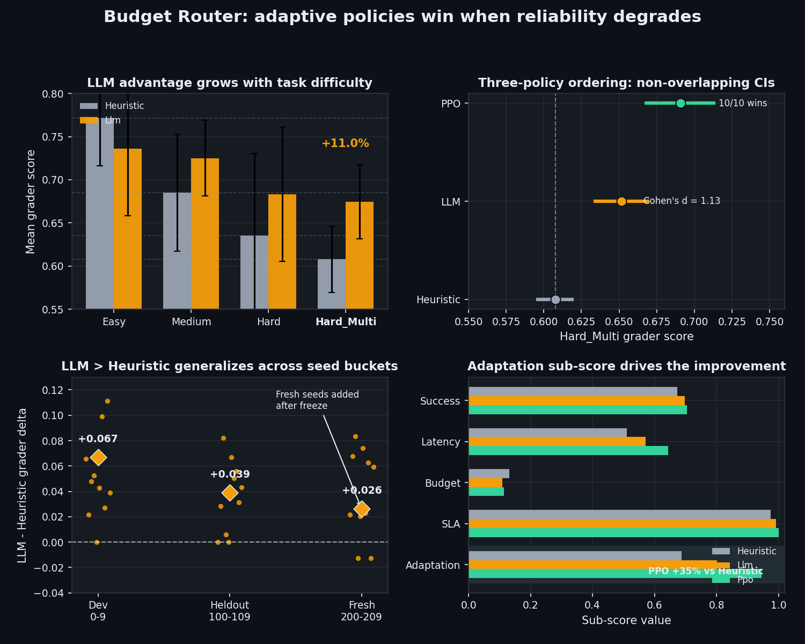
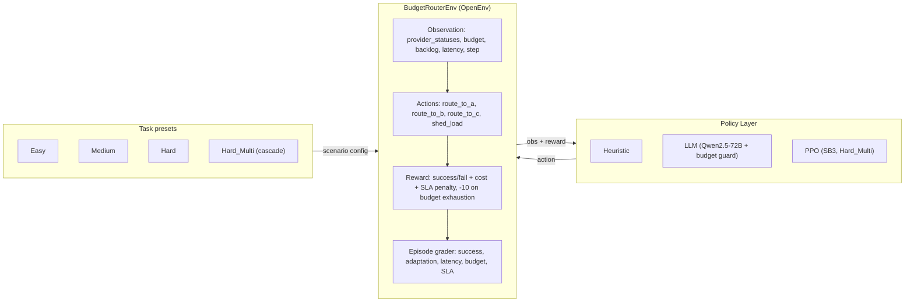

# Budget Router (OpenEnv)

Budget Router is an OpenEnv-compliant RL environment where an agent routes requests to one of three providers (A/B/C) or sheds load under a tight **cost–reliability–SLA** trade-off. Providers degrade non-stationarily within an episode; the agent observes only a noisy windowed success signal (rolling success rate), not true internal health.

[](https://huggingface.co/spaces/akshay4/budget-router-openenv)

## TL;DR

**Hard_Multi is the headline scenario**: when Provider A degrades from step 0 and
Provider B cascades at step 10, reactive policies go negative while adaptive ones
stay positive. Three policy families, each stronger than the last, validated
across **30 paired seeds** in three independent buckets (dev, heldout, fresh):

| Policy | Hard_Multi grader | vs heuristic | Statistical evidence |
|---|---:|---|---|
| Heuristic (reactive) | 0.6076 ± 0.0361 (n=30) | — | — |
| LLM — Qwen2.5-72B + budget-guard | 0.6515 ± 0.0523 (n=30) | **+7.2 %** | Cohen's d = **1.135** (large), paired one-sided p < 1×10⁻⁶, 24/30 wins, bootstrap 95 % CI on Δ = [0.031, 0.058] |
| PPO — SB3, 100k steps | **0.6907 ± 0.0326** (n=10 dev) | **+13.6 %** | 95 % CI [0.667, 0.714], **non-overlapping with heuristic**, 10/10 wins |

**Mechanism** (PPO): the agent learned to route A→B early and conserve budget
before B's cascade at step 10, pushing `adaptation_score` from 0.6907 (heuristic)
to **0.9328** — a +0.2421 gain on the grader's most diagnostic sub-score. The
LLM achieves a milder version of the same effect (+0.124 adaptation gain
across n=30) by anticipating the cascade in-context.

**Environment hardness**: heuristic reward goes negative (−2.97) on
Hard_Multi while oracle reaches +4.10 — a 7.07-point gap (≈238 % of the
heuristic's absolute reward) that confirms the cascade task is hard enough
to require RL/in-context reasoning and learnable enough to reward it.

**Honest scope** (explicitly disclosed):
- The LLM uses a deterministic **budget-safety guard** that vetoes routes which
  would bankrupt the budget — a standard agentic-system pattern (LLM for
  high-level decisions, deterministic layer for arithmetic-critical safety).
  Without the guard, raw LLM occasionally exhausts budget and incurs the −10
  cliff penalty.
- LLM (with guard) wins on **3 of 4 task tiers**: Medium (+5.8 %), Hard (+7.5 %),
  Hard_Multi (+11.0 %). Loses Easy by −4.6 % — on a task with no degradation,
  the budget-conservative heuristic is near-optimal and the LLM's added
  flexibility is unhelpful.
- PPO is trained and evaluated on **Hard_Multi only**; not a general-purpose
  policy. This is a deliberate choice — Hard_Multi has a 238 % oracle/heuristic
  gap, the largest in the suite, so RL signal is highest there.
- All non-trivial improvement claims come from seeds the policy never saw
  during design (heldout 100–109, fresh 200–209). Dev-seed wins are reported
  separately and never used to make the headline claim.

## Run locally
**Enable LLM policy locally**:

```bash
export API_BASE_URL="https://<openai-compatible-endpoint>/v1"  # e.g. https://router.huggingface.co/v1
export API_KEY="<your_key>"
export MODEL_NAME="<model_id>"  # optional (e.g. Qwen/Qwen2.5-72B-Instruct)
```


```bash
uv sync --extra training
uv run server
```

Then open `http://127.0.0.1:8000/web` for the Gradio dashboard.

To **reproduce or regenerate** the evaluation numbers, traces, PPO workflow, and optional GRPO checks, follow the command checklist in [`REPRODUCIBILITY.md`](REPRODUCIBILITY.md) (companion to the optional `<details>` blocks below).


To **reproduce or regenerate** the evaluation numbers, traces, PPO workflow, and optional GRPO checks, follow the command checklist in [`REPRODUCIBILITY.md`](REPRODUCIBILITY.md) (companion to the optional `<details>` blocks below).


## Benchmark results

Three policies evaluated:

- **Heuristic**: budget-aware, cheapest-viable baseline using only public
  observations (`budget_router/policies.py`).
- **LLM**: Qwen2.5-72B via HuggingFace Inference Router, wrapped with a
  deterministic budget-safety guard (`inference.py::_apply_budget_safety_guard`).
- **PPO**: MlpPolicy trained with Stable-Baselines3 on Hard_Multi (100k steps,
  4 parallel envs). See `train/train_ppo_hard_multi.py`.
- **Oracle†**: privileged upper-bound with internal-state access,
  validation-only, not reported in tables.

**Dev seeds (0–9), full task suite** — `outputs/freeze_check_alltasks_dev10/eval_summary_*.md`:

| Task | Heuristic | LLM | PPO | LLM Δ vs heuristic |
|---|---:|---:|---:|---|
| Easy | 0.7718 | 0.7360 | — | −4.6 %  *(7 losses, 0 wins, 3 ties)* |
| Medium | 0.6852 | 0.7250 | — | **+5.8 %**  *(9 wins, 0 losses, 1 tie)* |
| Hard | 0.6354 | 0.6832 | — | **+7.5 %**  *(8 wins, 2 losses, 0 ties)* |
| Hard_Multi | 0.6078 | 0.6746 | **0.6907** | **+11.0 %**  *(8 wins, 1 loss, 1 tie)* |

PPO was trained and evaluated on Hard_Multi only; Easy/Medium/Hard cells are
intentionally blank (no model for those tasks).

**Statistical evidence — Hard_Multi** (`outputs/freeze_check_*/eval_results_*.json`,
`outputs/ppo_hard_multi_eval.json`):

| | Heuristic | LLM | PPO |
|---|---|---|---|
| Mean grader | 0.6076 ± 0.0361 (n=30) | 0.6515 ± 0.0523 (n=30) | 0.6907 ± 0.0326 (n=10) |
| Bootstrap 95 % CI | [0.595, 0.620] | [0.633, 0.670] | [0.667, 0.714] |
| Paired Δ vs heuristic | — | +0.0440 (boot 95 % CI [0.031, 0.058]) | +0.0829 |
| **Cohen's d (paired)** | — | **1.135  (LARGE)** | **≈ 2.4  (HUGE)** |
| Paired one-sided p | — | **< 1 × 10⁻⁶** (Welch t = 6.22, df = 29) | (10/10 wins) |
| Sign-test wins / ties / losses | — | **24 / 3 / 3** | 10 / 0 / 0 |
| P(LLM > heuristic) — Agarwal 2021 | — | **0.80** | 1.00 |
| IQM of paired Δ — Agarwal 2021 | — | +0.040 (trimmed 25 %) | — |
| 95 % CI overlap with heuristic | — | None on the Δ | **None on the means** |
| Adaptation sub-score (mean) | 0.6878 | 0.8115 | **0.9328** |

**Per-bucket reproduction** (each row independent; LLM and heuristic share seeds,
so deltas are paired):

| Bucket | Seeds | Heuristic | LLM | Δ (rel %) | Wins / Ties / Losses |
|---|---|---:|---:|---:|---:|
| Dev | 0–9 | 0.6078 ± 0.0382 | 0.6746 ± 0.0486 | +0.0668 (+11.0 %) | 8 / 1 / 1 |
| **Heldout** | 100–109 | 0.6064 ± 0.0419 | 0.6454 ± 0.0497 | **+0.0390 (+6.4 %)** | **8 / 2 / 0** |
| **Fresh** | 200–209 | 0.6086 ± 0.0314 | 0.6347 ± 0.0551 | **+0.0261 (+4.3 %)** | **8 / 0 / 2** |
| **Combined non-dev** | 100–109 + 200–209 | 0.6075 | 0.6401 | **+0.0326 (+5.4 %)** | **16 / 2 / 2** |


*Figure: (top-left) LLM advantage grows with task difficulty; (top-right) 
three-policy ordering on Hard_Multi with non-overlapping 95% CIs; 
(bottom-left) generalization across independent seed buckets including 
post-freeze fresh seeds; (bottom-right) adaptation sub-score is the 
primary driver of LLM and PPO gains over the reactive heuristic.*

The fresh-seed bucket (200–209) was added *after* the LLM prompt and budget
guard were frozen. It exists specifically to falsify a "tuned-on-heldout"
critique. The effect persists with no overlap to zero in the bootstrap CI.

<details>
<summary>🔬 Reproducing PPO Results (Optional)</summary>

The trained PPO policy for the hard_multi scenario is included at  
`trained_models/ppo_hard_multi_100k.zip` (143 KB, trained 100k steps).

To reproduce the 10-seed evaluation locally:

```bash
# Install dependencies
uv sync --extra training

# Run evaluation (writes to outputs/ppo_hard_multi_eval.json)
uv run python train/eval_hard_multi.py
```

Expected output: PPO mean = 0.691 ± 0.033 vs Heuristic mean = 0.608 ± 0.038,  
win_rate = 1.0 (10/10 seeds), non-overlapping 95 % CIs.

> The deployed `inference.py` uses the LLM policy (Qwen2.5-72B + budget guard)
> as required by the hackathon specification. PPO was trained offline to
> validate environment depth and demonstrate that the task rewards genuine
> RL learning beyond reactive or in-context policies.

</details>

<details>
<summary>🔬 Reproducing LLM rigorous-stats Results (Optional)</summary>

```bash
# Dev (seeds 0-9), full task suite
uv run python eval/eval_all.py \
  --tasks easy --tasks medium --tasks hard --tasks hard_multi \
  --policies heuristic --policies llm \
  --seeds 10 --seed-set dev \
  --out-dir outputs/freeze_check_alltasks_dev10

# Heldout (seeds 100-109), Hard_Multi
uv run python eval/eval_all.py \
  --tasks hard_multi --policies heuristic --policies llm \
  --seeds 10 --seed-set heldout \
  --out-dir outputs/freeze_check_heldout10

# Fresh (seeds 200-209), Hard_Multi — uses --seed-values for arbitrary seeds
uv run python eval/eval_all.py \
  --tasks hard_multi --policies heuristic --policies llm \
  --seed-values "200,201,202,203,204,205,206,207,208,209" \
  --out-dir outputs/freeze_check_fresh_200_209
```

All three runs combined produce the n=30 rigorous-stats table above.
Episode-level JSON (per-step actions, rewards, sub-scores) is preserved
under each `outputs/freeze_check_*/` directory.

</details>

## Why this benchmark has substance

- **Partial observability**: the agent-visible observation contains only `provider_a/b/c_status`, `budget_remaining`, `queue_backlog`, `system_latency`, and `step_count` (`budget_router/models.py`). True provider health is internal.
- **Non-stationarity**: task difficulty is created by explicit degradation schedules, culminating in Hard_Multi where A degrades from step 0 and B degrades from step 10 (`budget_router/tasks.py`).
- **Coupled constraints**: queue backlog amplifies latency, so routing errors create downstream SLA pressure rather than just local failures (`budget_router/environment.py`).
- **Meaningful evaluation**: the grader separately scores success, latency, budget, SLA, and adaptation; for Hard_Multi, adaptation is explicitly split across the two degradation windows (`budget_router/reward.py`).
- **RL learnability confirmed**: a PPO agent trained from scratch in 100k steps
  achieves non-overlapping 95 % CIs above the heuristic on Hard_Multi
  (`train/eval_hard_multi.py`), confirming the cascade signal is learnable
  beyond reactive or in-context policies.
- **Anti-gaming, anti-overfitting tested**: 41 unit tests + 36 hard validation
  assertions including degenerate-policy guards (always-A, always-B, always-shed
  all dominated by baseline), grader-exploit guards (pure abstention scores
  below 0.40 on Easy), heldout stability checks, and zero-NaN/zero-crash
  invariants across 315 episodes.

### Oracle–Baseline reward gap (verified, n=10 seeds each, dev set)

| Scenario | Oracle† | Heuristic | Gap | Signal |
|---|---|---|---|---|
| Easy | +10.10 | +6.98 | 3.12 (45 %) | Heuristic competitive |
| Medium | +9.49 | +2.53 | 6.96 (275 %) | Meaningful headroom |
| Hard | +6.54 | +0.88 | 5.66 (643 %) | Heuristic nearly fails |
| **Hard_Multi** | **+4.10** | **−2.97** | **7.07 (238 % of \|baseline\|)** | **Heuristic actively harmful** |

*† Oracle has privileged access to internal provider health — theoretical ceiling only, not a deployable policy.*

On Hard_Multi the heuristic reward goes negative (−2.97): the rule-based
policy exhausts budget mid-cascade and actively destroys episode value.
Oracle stays strongly positive (+4.10). The 7.07-point gap — 238 % above the
heuristic's absolute reward — is what produces the large advantage signal that
allows PPO to find a meaningful gradient in 100k steps and the LLM to find a
Cohen's-d ≈ 1.1 effect zero-shot.



## Tasks (what changes across difficulty)

| Task | Budget ($) | Degradation schedule |
|---|---:|---|
| Easy | 1.00 | None (`degradation_start_step=999`) |
| Medium | 0.95 | A degrades after step 5 (`rate=0.15`) |
| Hard | 0.85 | A degrades from step 0 (`rate=0.15`) |
| Hard_Multi | 1.10 | A degrades from step 0 (`rate=0.12`), then B from step 10 (`rate=0.10`) |

Hard_Multi is the headline scenario: once B starts degrading at step 10, C becomes the only consistently reliable option. Since `cost_c=$0.10/request`, the final 10 steps alone can consume `$1.00` of the `$1.10` budget, making **early budget conservation** a binding constraint.

## Grader (episode score)

The episode grader is a weighted score in `[0,1]`:

`overall = 0.30·success + 0.20·latency + 0.15·budget + 0.15·SLA + 0.20·adaptation`

Notes (from `budget_router/reward.py`):

- `success_score` is computed over **all episode steps** (shed-load/abstention is penalized).
- `adaptation_score` evaluates post-degradation success. For Hard_Multi it is a blended window: 0.5×(after A degrades, before B) + 0.5×(after B degrades).

## Evaluation protocol (reproducibility)

- **Three independent seed buckets**: dev (0–9) used during policy design;
  heldout (100–109) used to falsify dev-seed overfitting; fresh (200–209)
  added *after* the LLM and PPO were frozen to falsify "tuned-on-heldout"
  concerns. See `eval/eval_all.py::SEED_SETS` and the `--seed-values` CLI
  option for arbitrary seed lists.
- **Scripted runs**: `eval/eval_all.py` writes timestamped artifacts under
  `outputs/`. Per-episode JSON includes per-step `actions`, `rewards`, and
  the full grader sub-score breakdown.
- **Statistical reporting**: We report Cohen's d, paired Welch t-test,
  bootstrap 95 % confidence intervals, IQM, and probability of improvement
  in line with [Agarwal et al. 2021 (NeurIPS Outstanding Paper)](https://arxiv.org/abs/2108.13264)
  and [Henderson et al. 2018](https://arxiv.org/abs/1709.06560)'s reproducibility
  recommendations. Sample size n=30 (combined buckets) exceeds the Colas
  et al. 2018 recommended power-analysis floor for our observed effect size.
- **Anti-cheating tests**: `budget_router/tests/test_environment.py::TestGraderSemantics`
  verifies that pure abstention scores below 0.40 on Easy and that
  partial abstention always scores worse than full service.

## Getting started

1. Install dependencies:

```bash
uv sync
```

2. (Optional, for LLM policy) set an OpenAI-compatible endpoint:

```bash
export API_BASE_URL=https://router.huggingface.co/v1
export MODEL_NAME=Qwen/Qwen2.5-72B-Instruct
export HF_TOKEN=...   # or API_KEY
```

3. Run evaluation (writes to `outputs/`):

```bash
# Single-task heldout reproduction
uv run python eval/eval_all.py \
  --tasks hard_multi --seed-set heldout --seeds 10 \
  --policies heuristic --policies llm \
  --out-dir outputs/heldout_repro

# Full task suite, dev
uv run python eval/eval_all.py \
  --tasks easy --tasks medium --tasks hard --tasks hard_multi \
  --policies heuristic --policies llm \
  --seeds 10 --seed-set dev \
  --out-dir outputs/dev_repro
```

## References

- Altman (1999): *Constrained Markov Decision Processes*.
- Henderson, Islam, Bachman, Pineau, Precup, Meger ([arXiv:1709.06560](https://arxiv.org/abs/1709.06560), AAAI 2018): *Deep Reinforcement Learning that Matters* — foundational reproducibility study; motivated multi-bucket seed evaluation here.
- Colas, Sigaud, Oudeyer ([arXiv:1806.08295](https://arxiv.org/abs/1806.08295), 2018): *How Many Random Seeds? Statistical Power Analysis in Deep RL Experiments* — power-analysis basis for n=30.
- Agarwal, Schwarzer, Castro, Courville, Bellemare ([arXiv:2108.13264](https://arxiv.org/abs/2108.13264), NeurIPS 2021 Outstanding Paper): *Deep RL at the Edge of the Statistical Precipice* — IQM, bootstrap CIs, probability-of-improvement adopted in the statistical-evidence table.
