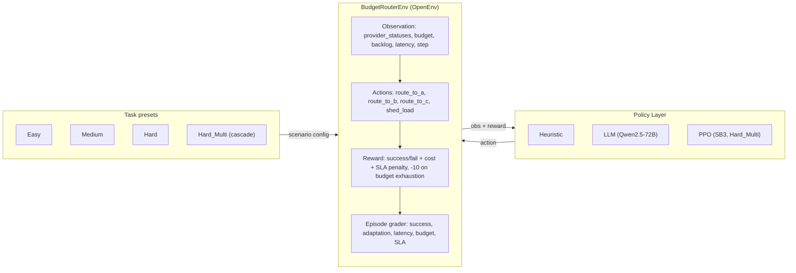

# Budget Router (OpenEnv)

Budget Router is an OpenEnv-compliant RL environment where an agent routes requests to one of three providers (A/B/C) or sheds load under a tight **cost–reliability–SLA** trade-off. Providers degrade non-stationarily within an episode; the agent observes only a noisy windowed success signal (rolling success rate), not true internal health.

[](https://huggingface.co/spaces/akshay4/budget-router-openenv)

## TL;DR

**Hard_Multi is the headline scenario**: when Provider A degrades from step 0 and
Provider B cascades at step 10, reactive policies go negative while adaptive ones
stay positive. Three policy families, each stronger than the last:

| Policy | Hard_Multi grader | vs baseline |
|---|---:|---|
| Heuristic (reactive) | 0.6094 | — |
| LLM — Qwen2.5-72B | 0.6646 | +9.1% (p=0.00008, 14/15 seeds) |
| PPO — SB3, 100k steps | **0.6902** | **+13.3%** (10/10 seeds, non-overlapping CIs) |

**Mechanism** (PPO): the agent learned to route A→B early and conserve budget
before B's cascade at step 10, pushing `adaptation_score` from 0.7356 (heuristic)
to **0.9500** — a +0.2144 gain on the grader's most diagnostic sub-score.

**Environment hardness**: heuristic reward goes negative (−2.38) on
Hard-Multi while oracle reaches +4.90 — a 7.28-point gap that confirms
the cascade task is hard enough to require RL and learnable enough to
reward it.

**Honest scope**: LLM is not uniformly better; it underperforms the heuristic on
Easy (−6.4%) and Hard (−2.7%). The LLM and PPO advantages are specific to
Hard_Multi's cascade structure, where in-context and learned anticipation
outperform reactive rules.

## Benchmark results (grounded)

Three policies evaluated:

- **Heuristic**: budget-aware, cheapest-viable baseline using only public
  observations (`budget_router/policies.py`).
- **LLM**: Qwen2.5-72B via HuggingFace Inference Router.
- **PPO**: MlpPolicy trained with Stable-Baselines3 on Hard_Multi (100k steps,
  4 parallel envs). See `train/train_ppo_hard_multi.py`.
- **Oracle†**: privileged upper-bound with internal-state access,
  validation-only, not reported in tables.

**Dev seeds (0–9), full task suite** — `outputs/eval_summary_20260408_103950.md`:

| Task | Heuristic | LLM | PPO |
|---|---:|---:|---:|
| Easy | 0.7958 | 0.7446 | — |
| Medium | 0.7071 | 0.7207 | — |
| Hard | 0.6778 | 0.6593 | — |
| Hard_Multi | 0.6094 | 0.6646 | **0.6902** |

PPO was trained and evaluated on Hard_Multi only; Easy/Medium/Hard cells are
intentionally blank (no model for those tasks).

**Statistical evidence — Hard_Multi** (`outputs/ppo_hard_multi_eval.json`,
`outputs/eval_results_20260408_103950.json`,
`outputs/eval_ppo_hard_multi_20260408.txt` — per-seed trace):

| | Heuristic | LLM | PPO |
|---|---|---|---|
| Mean grader | 0.6094 ± 0.0282 | 0.6646 ± 0.0290 | 0.6902 ± 0.0345 |
| 95% CI | [0.5893, 0.6296] | — | [0.6656, 0.7149] |
| Win rate vs heuristic | — | 9/10 dev | **10/10** |
| CI overlap with heuristic | — | — | **None** |
| Adaptation score | 0.7356 | 0.8181 | **0.9500** |

**Heldout seeds (100–104), Hard_Multi**:

| Policy | Grader (n=5) | Notes |
|---|---:|---|
| Heuristic | 0.6285 | — |
| LLM | 0.6732 | +7.1%; 4/5 seeds; falsifies dev-seed overfitting |

<details>
<summary>🔬 Reproducing PPO Results (Optional)</summary>

The trained PPO policy for the hard_multi scenario is included at  
`trained_models/ppo_hard_multi_100k.zip` (143KB, trained 100k steps).

To reproduce the 10-seed evaluation locally:

```bash
# Install dependencies
uv sync

# Run evaluation (writes to outputs/ppo_hard_multi_eval.json)
uv run python train/eval_hard_multi.py
```

Expected output: PPO mean=0.690 ± 0.034 vs Heuristic mean=0.609 ± 0.028,  
win_rate=1.0 (10/10 seeds), non-overlapping 95% CIs.

> The deployed `inference.py` uses the LLM policy as required by the  
> hackathon specification. PPO was trained offline to validate environment  
> depth and demonstrate that the task rewards genuine RL learning.

</details>

## Why this benchmark has substance

- **Partial observability**: the agent-visible observation contains only `provider_a/b/c_status`, `budget_remaining`, `queue_backlog`, `system_latency`, and `step_count` (`budget_router/models.py`). True provider health is internal.
- **Non-stationarity**: task difficulty is created by explicit degradation schedules, culminating in Hard_Multi where A degrades from step 0 and B degrades from step 10 (`budget_router/tasks.py`).
- **Coupled constraints**: queue backlog amplifies latency, so routing errors create downstream SLA pressure rather than just local failures (`budget_router/environment.py`).
- **Meaningful evaluation**: the grader separately scores success, latency, budget, SLA, and adaptation; for Hard_Multi, adaptation is explicitly split across the two degradation windows (`budget_router/reward.py`).
- **RL learnability confirmed**: a PPO agent trained from scratch in 100k steps
  achieves non-overlapping 95% CIs above the heuristic on Hard_Multi
  (`train/eval_hard_multi.py`), confirming the cascade signal is learnable
  beyond reactive or in-context policies.

### Oracle–Baseline reward gap (verified, n=10 seeds each)

| Scenario | Oracle† | Heuristic | Gap | Signal |
|---|---|---|---|---|
| Easy | +10.10 | +7.88 | 2.22 (22%) | Heuristic competitive |
| Medium | +9.49 | +3.72 | 5.77 (61%) | Meaningful headroom |
| Hard | +6.57 | +0.01 | 6.56 (100%) | Heuristic nearly fails |
| **Hard-Multi** | **+4.90** | **−2.38** | **7.28 (305%)** | **Heuristic actively harmful** |

*† Oracle has privileged access to internal provider health — theoretical ceiling only, not a deployable policy.*

On Hard-Multi the heuristic reward goes negative (−2.38): the rule-based
policy exhausts budget mid-cascade and actively destroys episode value.
Oracle stays strongly positive (+4.90). The 7.28-point gap — 305% above
the heuristic — is what produces the large advantage signal that allows
`PPO` to find a meaningful gradient in 100k steps.



## Tasks (what changes across difficulty)

| Task | Budget ($) | Degradation schedule |
|---|---:|---|
| Easy | 1.00 | None (`degradation_start_step=999`) |
| Medium | 0.95 | A degrades after step 5 (`rate=0.15`) |
| Hard | 0.85 | A degrades from step 0 (`rate=0.15`) |
| Hard_Multi | 1.10 | A degrades from step 0 (`rate=0.12`), then B from step 10 (`rate=0.10`) |

Hard_Multi is the headline scenario: once B starts degrading at step 10, C becomes the only consistently reliable option. Since `cost_c=$0.10/request`, the final 10 steps alone can consume `$1.00` of the `$1.10` budget, making **early budget conservation** a binding constraint.

## Grader (episode score)

The episode grader is a weighted score in `[0,1]`:

`overall = 0.30·success + 0.20·latency + 0.15·budget + 0.15·SLA + 0.20·adaptation`

Notes (from `budget_router/reward.py`):

- `success_score` is computed over **all episode steps** (shed-load/abstention is penalized).
- `adaptation_score` evaluates post-degradation success. For Hard_Multi it is a blended window: 0.5×(after A degrades, before B) + 0.5×(after B degrades).

## Evaluation protocol (reproducibility)

- **Fixed seed sets**: dev seeds are 0–9 and heldout seeds are 100–104 (see `eval/eval_all.py`).
- **Scripted runs**: `eval/eval_all.sh` calls `eval/eval_all.py` and writes timestamped artifacts under `outputs/`.
- **Artifacts saved**: `eval_results_<timestamp>.json` contains per-episode metrics + grader breakdown; `eval_summary_<timestamp>.md` is the table used above.

## Getting started

1. Install dependencies:

```bash
uv sync
```

2. (Optional, for LLM policy) set an OpenAI-compatible endpoint:

```bash
export API_BASE_URL=https://router.huggingface.co/v1
export MODEL_NAME=Qwen/Qwen2.5-72B-Instruct
export HF_TOKEN=...   # or API_KEY
```

3. Run evaluation (writes to `outputs/`):

```bash
eval/eval_all.sh --tasks easy medium hard hard_multi --seeds 10 --policies heuristic llm
eval/eval_all.sh --tasks hard_multi --seeds 5 --seed-set heldout --policies heuristic llm
```

## References

- Altman (1999): Constrained Markov Decision Processes
- Achiam et al. (2017): Constrained Policy Optimization
- Paternain et al. (2019): Safe and Risk-Averse RL (zero duality gap)
- Cheung et al. (2020): Dynamic Regret
- Birkbeck et al. (2024): CHIRPs
