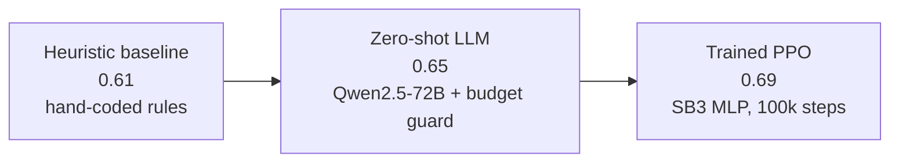
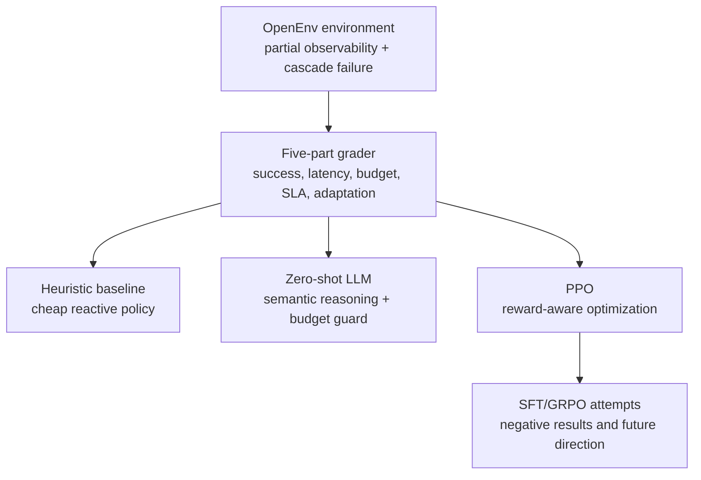

# Budget Router: Teaching Agents to Survive Cascading API Failures Under Budget

Production AI systems do not fail politely.

An application may depend on several LLM or API providers, each with different cost, latency, and reliability profiles. One provider becomes flaky. Traffic shifts. The next fallback becomes overloaded or starts degrading. The system still has a budget, users still expect latency, and the router never sees the true internal health of the providers. It only sees noisy public signals: recent success rates, backlog, latency, and remaining budget.

That is the problem Budget Router is built to study.

Budget Router is an OpenEnv-compliant reinforcement learning environment where an agent routes each request to Provider A, B, C, or sheds load. A is cheap, B is moderate, C is reliable but expensive. The agent's job is not simply to pick the best provider now. It must preserve enough budget to survive what happens later.

The interesting case is `Hard_Multi`: Provider A degrades from the beginning, and Provider B cascades later in the episode. This creates a two-phase incident. A naive router can look reasonable early and still fail late because it spent too much budget before the real cascade arrived.

Demo video: [Budget Router walkthrough](https://youtu.be/Z1A2zND_x70).

This is a small environment, but it captures a real infrastructure question:

> Can an agent learn budget-aware reliability behavior under partial observability and non-stationary provider degradation?

## TL;DR

Budget Router is not a claim that a 20-step toy simulation is production routing. It is a compact, reproducible benchmark for a production-shaped failure mode: budgeted API routing under cascading degradation.

On the headline `Hard_Multi` task, we compare three policy families:

| Policy | What it is | Hard_Multi grader | Main takeaway |
|---|---|---:|---|
| Heuristic | Hand-coded reactive baseline | ~0.61 | A real baseline, but brittle under cascade failure |
| Zero-shot LLM | Qwen2.5-72B with a deterministic budget guard | ~0.65 | In-context reasoning helps when observations are semantically meaningful |
| PPO | Small SB3 MLP trained on the environment | ~0.69 | The reward signal is learnable and stronger than hand rules |



We also ran post-training experiments beyond PPO:

- SFT on Qwen2.5-1.5B via Hugging Face Jobs completed end-to-end, but did **not** beat the heuristic on the latest 10-seed evaluation: `0.577` vs `0.596`, with 3/10 wins.
- GRPO was attempted, but did not converge reliably in our setup.
- The negative result is useful: this environment rewards sequential credit assignment, probing, recovery, and budget conservation. Plain behavioral cloning can imitate action patterns without learning why those actions matter.


*Figure: README evidence summary. The strongest claims are the three-policy ordering on `Hard_Multi`, heldout/fresh seed generalization for the LLM, and adaptation-score gains over the reactive heuristic.*

## The Environment

Budget Router exposes a simple action space:

- `route_to_a`
- `route_to_b`
- `route_to_c`
- `shed_load`

The observation is intentionally public and partial. The policy sees:

- rolling provider success estimates,
- remaining budget,
- queue backlog,
- system latency,
- episode progress.

It does **not** see the true hidden provider health. This makes the problem a partially observable decision problem rather than a lookup table. The agent has to infer whether a provider is actually degrading or whether it just saw noise.

The task suite escalates difficulty:

| Task | Degradation pattern | Why it matters |
|---|---|---|
| `Easy` | No degradation | Budget-conservative rules are hard to beat |
| `Medium` | A degrades after step 5 | Reactive switching begins to matter |
| `Hard` | A degrades from step 0 | Early adaptation matters |
| `Hard_Multi` | A degrades from step 0, B from step 10 | Cascade failure forces budget-aware anticipation |

`Hard_Multi` is the core benchmark. If the router burns money on expensive fallbacks too early, it may have no budget left when B starts failing. If it stays cheap for too long, it loses success and SLA. If it sheds load too often, it avoids cost but fails the user.

That is the point: there is no single dominant action.

## The Grader

The episode grader is a weighted score in `[0, 1]`:

```text
overall = 0.30 * success
        + 0.20 * latency
        + 0.15 * budget
        + 0.15 * SLA
        + 0.20 * adaptation
```

The grader is designed so that obvious reward hacks are unattractive:

| Shortcut | Why it fails |
|---|---|
| Always route to C | Good latency, but expensive and budget-risky |
| Always shed load | Avoids cost, but earns no success or adaptation |
| Always use A | Cheap, but collapses once A degrades |
| Switch only after failure | Too late in `Hard_Multi`, because budget and latency errors compound |

This is best understood as a soft-constraint MDP. Budget and SLA pressure are real and measured, but they are encoded through reward terms rather than enforced through a full constrained-MDP Lagrangian. That distinction matters. The environment is honest about tradeoffs instead of pretending the constraint design is solved.

## What Worked

### 1. The heuristic is a real baseline, not a strawman

The heuristic uses public observations and chooses the cheapest viable provider. It is budget-aware and reactive. On easy settings, this is exactly the kind of policy that should be strong.

That is important for judge trust. If a learned policy only beats random or a broken baseline, the environment is not very informative. Budget Router's baseline is good enough to make improvement nontrivial, but limited enough that cascade failure exposes its weakness.

On `Hard_Multi`, the heuristic reaches roughly `0.61`. It is not useless; it is just too reactive for a delayed cascade.

### 2. Zero-shot LLM routing improves because the state is semantically meaningful

The LLM policy is not trained on Budget Router. It receives structured observations with meaningful field names:

```text
provider_a_status: 0.42
budget_remaining: 0.31
queue_backlog: 0.20
system_latency: 0.55
step_count: 0.60
```

That matters. A language model can reason about "budget remaining," "provider status," and "latency" without gradient updates. The prompt also includes practical routing guidance: do not treat an unprobed `0.500` status as confirmed health, pay attention to trends, and avoid bankruptcy.

The production-facing LLM policy includes a deterministic budget-safety guard. This is not hidden. It is a deliberate agentic-system pattern: use the model for high-level routing judgment, and use deterministic code for arithmetic-critical safety. Without this guard, raw LLM behavior can sometimes spend itself into the budget cliff.

On the README's combined `Hard_Multi` evaluation, the LLM improves over the heuristic across dev, heldout, and fresh seed buckets. The important claim is not that the LLM is magical. The claim is that semantically self-describing environments let a foundation model bring useful priors to a new control problem.

### 3. PPO proves the environment is learnable

PPO is a small neural policy trained directly on environment interaction. It is not an LLM, and it is not the post-training story. Its role is scientific: if a small policy gradient method can improve over the heuristic, the reward signal has enough structure to optimize.

The PPO policy uses the same environment mechanics through a Gym wrapper. The wrapper converts OpenEnv-style typed observations into arrays for Stable-Baselines3, but PPO still routes through the same `BudgetRouterEnv.step()` dynamics and grader.

On `Hard_Multi`, PPO reaches roughly `0.69` and beats the heuristic across the reported seeds. The adaptation sub-score is the clearest mechanism: PPO learns to preserve budget early and route more effectively when the cascade arrives.

The honest limitation is that PPO sees `step_count`. In a fixed 20-step task, it may learn a schedule keyed partly to the clock: switch away from A early, prepare for B around step 10. That is still useful environment-validation evidence, but it is not the same as proving open-ended reactive reasoning. The LLM result is the stronger evidence for in-context reactive use of semantic observations.

## What Did Not Work

The post-training experiments are just as important as the wins.

### SFT: the pipeline worked, the policy did not improve enough

We built a full supervised fine-tuning pipeline:

1. Generate trajectories from a stronger teacher policy.
2. Convert observations and actions into chat-style training examples.
3. Push the dataset to Hugging Face.
4. Train a LoRA adapter on `Qwen/Qwen2.5-1.5B-Instruct` using Hugging Face Jobs.
5. Merge and push the model.
6. Evaluate against the heuristic baseline.

The operational pipeline worked. The HF Jobs flow trained and evaluated the model on GPU infrastructure. This matters for reproducibility: the fine-tuning path is not a sketch; it is runnable through `generate_sft_data.py`, `train_sft.py`, `eval_sft.py`, and `scripts/submit_sft_hf_jobs.sh`.

But the latest SFT evaluation did not beat the heuristic. On 10 `Hard_Multi` seeds, SFT scored `0.577` vs heuristic `0.596`, winning 3/10 seeds.

That is not a result to hide. It is the most useful negative result in the project.

The likely reason is that behavioral cloning sees only good-looking actions, not the counterfactuals. It can learn "route to B often" or "avoid C when budget is low," but it does not directly learn why a near-miss action is bad, how budget errors compound, or when probing is worth the short-term risk.

In Budget Router, the objective is episodic. One bad switch can erase a good early trajectory. A static label does not carry the full consequence of that decision.

### GRPO: promising direction, not a successful result yet

We also attempted GRPO-style reward optimization for an LLM policy. That is the more natural post-training direction for an OpenEnv agent, because the model can interact with the environment and receive reward from actual consequences.

In our current run, GRPO did not produce a reliable improvement. The pitch notes reward trending downward, weak rollout quality, and mode collapse in the attempted setup. The practical lesson is that GRPO needs more than a valid environment wrapper. It needs enough reward variance, enough model capacity, stable rollouts, and careful exploration.

So the honest conclusion is:

> PPO shows the environment is learnable. Zero-shot LLM shows semantic observations are useful. SFT shows imitation alone is not enough. GRPO remains the right research direction, but not a claimed win in this submission.

## Why This Is Still a Strong Result

The strongest version of Budget Router is not "we found one trick that wins." It is this:



Budget Router has the properties a useful post-training environment should have:

| Property | Evidence |
|---|---|
| Non-trivial | Heuristic beats random but leaves headroom; oracle gap is largest on `Hard_Multi` |
| Learnable | PPO improves over heuristic on the hardest task |
| Semantically agentic | Zero-shot LLM improves because observations are meaningful |
| Not trivially gameable | Always-shed and always-expensive policies are penalized |
| Reproducible | README and `REPRODUCIBILITY.md` describe seed buckets, traces, saved JSON, and command paths |
| Honest | SFT and GRPO attempts are reported without overstating them |

That combination is rare in hackathon environments. Many environments are easy to demo but hard to falsify. Budget Router is designed to be falsified: run the seeds, inspect the traces, compare sub-scores, and check whether improvement comes from adaptation rather than a loophole.

## Reproducibility

The repo is structured so judges can inspect both aggregate results and exact behavior.

**REPRODUCIBLE RESULTS: use [`REPRODUCIBILITY.md`](REPRODUCIBILITY.md) as the source-of-truth command checklist.**

**IF THE HUGGING FACE SPACE OR HF JOBS CODE PATH FAILS, RUN THE GITHUB/LOCAL CODE DIRECTLY FROM [`akshay-babbar/budget-router-openenv`](https://github.com/akshay-babbar/budget-router-openenv). THE GITHUB CODE IS THE MOST UP-TO-DATE VERSION.**

Key artifacts:

- `README.md`: headline benchmark tables and evidence figure.
- `REPRODUCIBILITY.md`: command checklist and falsification guide.
- `eval/eval_all.py`: heuristic vs LLM evaluation across task and seed buckets.
- `eval/trace_episode.py`: step-by-step episode traces.
- `train/eval_hard_multi.py`: PPO evaluation path.
- `generate_sft_data.py`: SFT dataset generation from teacher trajectories.
- `train_sft.py`: LoRA SFT training script for Hugging Face Jobs.
- `eval_sft.py`: SFT model evaluation against the heuristic.
- `scripts/submit_sft_hf_jobs.sh`: orchestration for data, training, and evaluation jobs.

For the SFT pipeline, the intended run looks like:

```bash
export TEACHER_POLICY=ppo
export HF_JOB_FLAVOR=a10g-large
export HF_JOB_NAMESPACE=akshay4
export DATASET_REPO=akshay4/budget-router-sft-data
export OUTPUT_REPO=akshay4/budget-router-sft-qwen1.5b
export SFT_MODEL_REPO=$OUTPUT_REPO
export SFT_N_EPISODES=100
export SFT_TOP_FRACTION=0.30
export NUM_EPOCHS=3
export N_SEEDS=10

./scripts/submit_sft_hf_jobs.sh
```

The important point is not that this SFT model won. It did not. The important point is that the environment can produce training data, launch model training, push artifacts, and evaluate the resulting policy. That closes the environment-to-training-to-evaluation loop, even when the experimental result is negative.

## The Research Lesson

Budget Router is a reminder that post-training methods should match the task.

For static classification, supervised fine-tuning may be enough. For sequential decision-making under budget constraints, static imitation is often too weak. The agent needs to learn from consequences: what happens after a risky fallback, what happens when it fails to probe, what happens when it saves budget early, and what happens when it arrives at the cascade with no runway left.

That is why PPO worked better than SFT here. PPO receives feedback from the environment. It optimizes the episode objective directly. The zero-shot LLM also performs well because it brings external priors about risk, cost, and reliability to a semantically described state.

The next research step is not to pretend SFT solved the problem. It is to use SFT as a warm start or distillation layer, then apply environment-aware RL with better rollout diversity and reward normalization.

## Conclusion

Budget Router is an incident-commander environment for budgeted API reliability. It asks a simple question with real consequences:

> When providers degrade and budget is running out, can an agent adapt before the cascade breaks the system?

The answer from our experiments is nuanced:

- hand-coded rules are strong but brittle,
- zero-shot LLM reasoning helps when the observation schema is meaningful,
- PPO confirms the environment has a learnable reward signal,
- SFT and GRPO are not claimed wins, but they reveal where the hard part actually is.

That is the story we think is worth submitting: a reproducible environment, a real baseline, measurable improvement, and enough intellectual honesty that the failures make the benchmark more credible rather than less.
